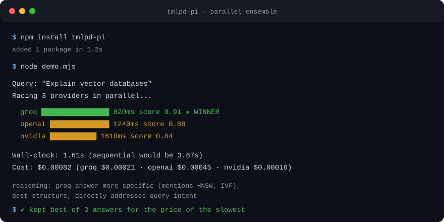

# tmlpd-pi — Run N LLMs in parallel, keep the best answer

**Picking one LLM means gambling: the cheap model fumbles hard queries, the expensive model burns money on easy ones. tmlpd-pi calls every provider **simultaneously**, scores each answer, and returns the winner — with the receipts (per-provider scores, latency, cost).**

`pi` = extension for the [PI coding agent](https://github.com/badlogic/pi-mono). TMLPD = parallel multi-LLM execution with confidence-weighted ensemble merging. Part of the [A3M Router](https://github.com/Das-rebel/a3m-router) ecosystem.

[](https://www.npmjs.com/package/tmlpd-pi)
[](https://www.npmjs.com/package/tmlpd-pi)
[](https://github.com/Das-rebel/tmlpd-skill/blob/main/LICENSE)
[](https://www.npmjs.com/package/tmlpd-pi)
[](https://github.com/Das-rebel/tmlpd-skill)



## In 30 seconds

```bash
npm install tmlpd-pi
```

```typescript
import { executeEnsemble } from "tmlpd-pi";

// 3 providers race in parallel. Best answer wins. You keep every score.
const result = await executeEnsemble(
  "Explain vector databases",
  "You are a precise engineering mentor.",
  "",
  {
    groq:  callGroq,   // your existing provider calls
    nvidia: callNvidia,
    openai: callOpenAI,
  }
);

console.log(result.winner);              // "groq"
console.log(result.scores);              // { groq: 0.91, nvidia: 0.84, openai: 0.88 }
console.log(result.timing.totalMs);      // wall-clock = slowest provider, not the sum
```

**Same latency as your slowest provider — not the sum of all three.** Sequential fallback is 3x slower and commits you to the first answer before you've seen the alternatives.

## Why parallel ensemble instead of sequential fallback?

| | Sequential fallback | tmlpd-pi ensemble |
|:--|:--|:--|
| Latency for N providers | sum of all attempts | slowest single provider |
| Answer quality | first non-failing model | confidence-scored best-of-N |
| Failure handling | try next on error | failed providers simply don't score |
| Cost visibility | hidden per-call | per-provider cost breakdown |
| Evidence | none | transparent `reasoning` for the pick |

Complements (not replaces) routers like [A3M Router](https://github.com/Das-rebel/a3m-router) or LiteLLM: routers pick *one* model per request; tmlpd-pi is the layer that picks the best *answer* when you run several.

## Features

| Feature | What it does |
|:--------|:-------------|
| **Parallel execution** | Run N providers simultaneously with configurable concurrency |
| **Ensemble scoring** | Score answers on specificity, structure, and relevance; merge complementary results |
| **Query-type presets** | Auto-configure provider + temperature per task type (code, reasoning, chat) |
| **Token Optimization** | 6 patterns for 40-60% token reduction (details below) |
| **Cost tracking** | Per-query cost with provider breakdown + budget enforcement |
| **Persistent memory** | Cross-session `.memory.json` with keyword indexing |
| **Caching layers** | Semantic cache + RadixAttention-style prefix caching |
| **Reliability** | Circuit breaker, retry with exponential backoff |
| **Local LLMs** | Ollama / vLLM / LM Studio providers for zero-cost, private runs |
| **Batch processing** | Priority-queue batch executor with progress callbacks |
| **Python bindings** | `tmlpd` on PyPI — LangChain / LlamaIndex / AutoGen / CrewAI integrations |

## Token Optimization — 6 patterns (40-60% token reduction)

Research-backed patterns from [arXiv:2608.17188](https://arxiv.org/abs/2608.17188):

| Pattern | Description |
|:--------|:------------|
| **Semantic Cache** | Embedding-based similarity caching (cosine > 0.85 threshold) |
| **Context Stratification** | Tiered context levels (LOW: 512 tokens, MEDIUM: 2048, HIGH: 8192) |
| **Token-Aware Fallback** | Route to cheap/medium/expensive models by token count |
| **Schema Contraction** | Inject schema reference instead of full description |
| **Fetch-Once/Process-Local** | One expensive fetch, extract with cheap model |
| **Inter-Agent Compression** | Compress messages between agents |

```typescript
import { TokenOptimizer } from "tmlpd-pi";

const optimizer = new TokenOptimizer();
const optimized = await optimizer.optimizeQuery("Explain quantum computing", history);
console.log(optimized.contextLevel);      // "LOW" | "MEDIUM" | "HIGH"
console.log(optimized.recommendedModel);  // cheapest capable model
console.log(optimized.cacheHit);          // true = skip the call entirely
```

## Key exports

- `executeEnsemble`, `mergeComplementary`, `recordFeedback` — ensemble voting
- `createPresetRouter`, `getPresetForQuery`, `DEFAULT_PRESETS` — query presets
- `TokenOptimizer`, `SemanticCache`, `ContextStratifier`, `TokenAwareFallback` — token optimization
- `createTMLPD`, `TMLPDTools` — core parallel execution
- `CostTracker`, `BudgetEnforcer` — cost tracking
- `EpisodicMemoryStore` — persistent memory with auto-save
- `ResponseCache`, `PrefixCache` — caching layers
- `createOllamaProvider`, `createVLLMProvider`, `createLMStudioProvider` — local LLMs
- `executeBatch`, `BatchProcessor` — batch processing
- `HALOOrchestrator`, `MCTSWorkflowOptimizer` — advanced orchestration

## Research backing

- **Token Optimization** ([arXiv:2608.17188](https://arxiv.org/abs/2608.17188)) — 6 patterns for 40-60% token reduction
- **RouteLLM** ([arXiv:2404.06035](https://arxiv.org/abs/2404.06035)) — learned cost-quality routing
- **RadixAttention** ([arXiv:2312.07104](https://arxiv.org/abs/2312.07104)) — 5-10x speedup via prefix caching
- **Medusa** ([arXiv:2401.10774](https://arxiv.org/abs/2401.10774)) — 2-3x faster generation
- **A-Mem** ([arXiv:2502.12110](https://arxiv.org/abs/2502.12110)) — episodic memory patterns

## Links

- [Python package (tmlpd on PyPI)](python/) — LangChain/LlamaIndex/AutoGen/CrewAI bindings
- [Quickstart examples](examples/QUICKSTART.md)
- [A3M Router](https://github.com/Das-rebel/a3m-router) — intelligent LLM routing gateway

## License

MIT — see [LICENSE](LICENSE).

---

*"Nobody does parallel multi-LLM execution with result merging. Everyone does sequential fallback."*
